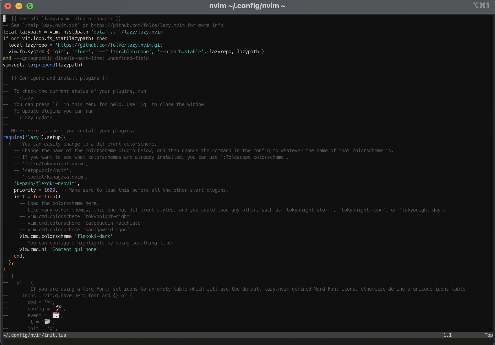
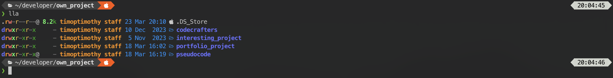
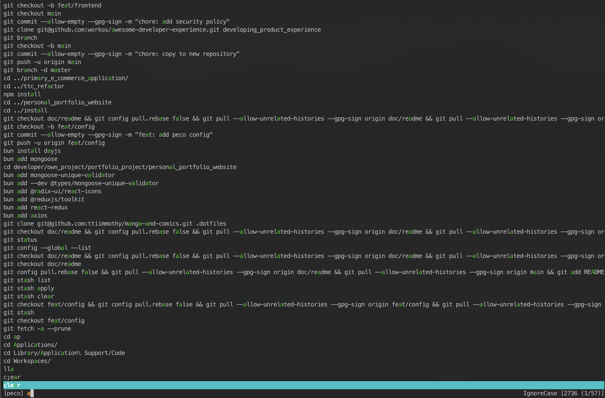
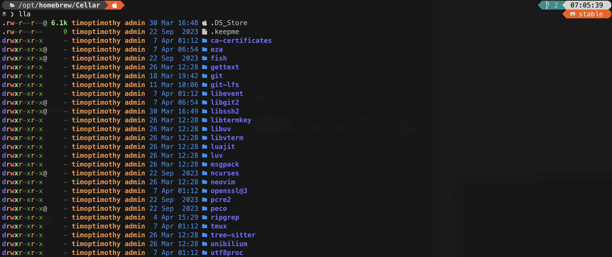
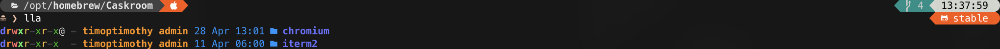
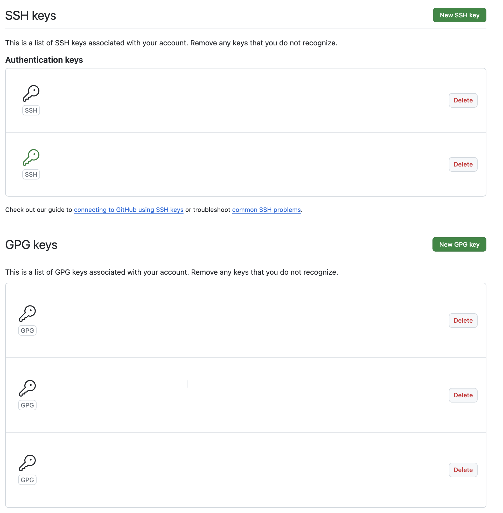

# Dotfiles (minimal version)

Dotfiles is for storing dotfiles to kickstart.

### Sample iterm view



## Contents

- [Shell setup](#shell-setup)
- [Terminal configuration](#terminal-configuration)
- [Dotfiles](#dotfiles-current)
- [Git configuration](#git-configuration)
- [Create symlink (symbolic link)](#create-symlinks-in-the-home-directory)
- [License](#license)

### Requirements

- a terminal that support true color and *undercurl*:
  - [iterm](https://iterm2.com/) **(macOS)**

## Shell setup
**(macOS)**

### Fish shell

- [Fish shell](https://fishshell.com/)
- [Fisher](https://github.com/jorgebucaran/fisher) - Plugin manager
- [Tide](https://github.com/IlanCosman/tide) - Shell theme. Use version 5: `fisher install ilancosman/tide@v5`
- Nerd fonts - Powerline-patched fonts. It can be directly downloaded from the [files](#font-installation) below without using `homebrew`, so **Don't** do `brew install font-hack-nerd-font`. It will consume more storages by installing from `homebrew`.
- [Eza](https://github.com/eza-community/eza) - `ls` replacement
- [Peco](https://github.com/peco/peco) - Interactive filtering
- [Zoxide](https://github.com/ajeetdsouza/zoxide) - Directory jumping, `cd` replacement with extensive features

#### Commands for installing `eza` and `peco`

```bash
brew install eza
brew install peco
```

##### Optional installation for `fish shell`

- [ghq](https://github.com/x-motemen/ghq) - Local Git repository organizer
- [fzf](https://github.com/PatrickF1/fzf.fish) - Interactive filtering, fuzzy finder in fish shell
- [z for fish](https://github.com/jethrokuan/z) - Directory jumping, `cd` replacement  with extensive features

### Font Installation

#### Manual font installation

1. Download these four ttf files:
    - [MesloLGS NF Regular.ttf](
       https://github.com/romkatv/powerlevel10k-media/raw/master/MesloLGS%20NF%20Regular.ttf)
    - [MesloLGS NF Bold.ttf](
       https://github.com/romkatv/powerlevel10k-media/raw/master/MesloLGS%20NF%20Bold.ttf)
    - [MesloLGS NF Italic.ttf](
       https://github.com/romkatv/powerlevel10k-media/raw/master/MesloLGS%20NF%20Italic.ttf)
    - [MesloLGS NF Bold Italic.ttf](
       https://github.com/romkatv/powerlevel10k-media/raw/master/MesloLGS%20NF%20Bold%20Italic.ttf)
1. Double-click on each file and click "Install". This will make `MesloLGS NF` font available to all
   applications on your system.
1. Set the `terminal` and `iterm` to use these fonts in the settings

### Neovim color

- [x] [kepano/flexoki-neovim](https://github.com/kepano/flexoki-neovim)

## Terminal configuration

### Images for fish shell




## dotfiles (current)

1. [.profile](.profile)
1. [.zprofile](.zprofile)
1. [.zshrc](.zshrc)
1. [.zshenv](.zshenv)
1. [.gitconfig](.gitconfig)
1. [fish_user_key_bindings.fish](.config/fish/functions/fish_user_key_bindings.fish)
1. [peco_select_history.fish](.config/fish/functions/peco_select_history.fish)
1. [config-osx.fish](.config/fish/config-osx.fish)
1. [config.fish](.config/fish/config.fish)
1. [tide.fish](.config/fish/conf.d/tide.fish)
1. [nvim/init.lua](.config/nvim/init.lua)
1. [peco/config.json](.config/peco/config.json)
1. [tmux.conf](.config/tmux/tmux.conf)
1. [tmux/macos.conf](.config/tmux/macos.conf)
1. [tmux/status_line.conf](.config/tmux/status_line.conf)
1. [tmux/utility.conf](.config/tmux/utility.conf)
1. [.warp/themes/color_dark.yml](.warp/themes/color_dark.yml)
1. [.warp/themes/color_light.yml](.warp/themes/color_light.yml)

### Software installation (let the dotfiles work)

1. [homebrew](https://brew.sh/)
1. [git](https://git-scm.com/download/mac)
1. [node.js, npm](https://nodejs.org/en)
1. [go](https://go.dev/)
1. [pnpm](https://pnpm.io/installation) - Use command `curl -fsSL https://get.pnpm.io/install.sh | sh -`
1. [gnupg](https://www.gnupg.org/download/) (for **`--gpg-sign`** tag in git commit)
1. [Raycast](https://raycast.com/)

#### Images showing the things installed by brew




`git`

`eza`

`fish`

`peco`

`neovim`

`tmux`

`ripgrep` (**important for neovim telescope searching**)

[`git-lfs`](https://git-lfs.com/)

`iterm`

`chromium`

###### other softwares showing in the above image are default downloaded after installing `brew` and other softwares that mentioned above (like `luv` is installed itself after installing `neovim`), `don't` need to run `brew install $(software-name)`

## Git configuration

- [ ] generate `ssh key` in new machine

```bash
ssh-keygen
```

- [ ] the key is stored in `$HOME/.ssh/id_rsa.pub` or `~/.ssh/id_rsa/pub`, paste it to [gitlab settings](https://github.com/settings/keys) and `gitlab` (if you're using)



- [ ] `GPG (GNU Privacy Guard) key` is stored in `~/.gnupg` after installation

## Create symlinks in the home directory

```zsh
ln -s ~/.dotfiles/.zshrc ~/.zshrc
ln -s ~.dotfiles/.zprofile ~/.zprofile
ln -s ~.dotfiles/.zshenv ~/.zshenv
# need to update own gitconfig first
ln -s ~/.dotfiles/.gitconfig ~/.gitconfig
ln -s ~/.dotfiles/moderator/.gitignore_global ~/.gitignore_global
ln -s ~/.dotfiles/.profile ~/.profile
ln -s ~.dotfiles/.config/fish/config-osx.fish ~/.config/fish/config-osx.fish
ln -s ~/.dotfiles/.config/fish/config.fish ~/.config/fish/config.fish
ln -s ~/.dotfiles/.config/fish/conf.d/tide.fish ~/.config/fish/conf.d/tide.fish
ln -s ~/.dotfiles/.config/fish/functions/fish_user_key_bindings.fish ~/.config/fish/functions/fish_user_key_bindings.fish
ln -s ~/.dotfiles/.config/fish/functions/peco_select_history.fish ~/.config/fish/functions/peco_select_history.fish
ln -s ~/.dotfiles/.config/peco/config.json ~/.config/peco/config.json
ln -s ~/.dotfiles/.config/nvim/init.lua ~/.config/nvim/init.lua
ln -s ~/.dotfiles/.config/nvim/lazy-lock.json ~/.config/nvim/lazy-lock.json
ln -s ~/developer/github_repository/dotfiles/.config/tmux/macos.conf  ~/.config/tmux/macos.conf
ln -s ~/.dotfiles/.config/tmux/status_line.conf  ~/.config/tmux/status_line.conf
ln -s ~/.dotfiles/.config/tmux/tmux.conf  ~/.config/tmux/tmux.conf
ln -s ~/.dotfiles/.config/tmux/utility.conf  ~/.config/tmux/utility.conf
ln -s ~/.dotfiles/.warp/themes/color_dark.yml  ~/.warp/themes/color_dark.yml
ln -s ~/.dotfiles/.warp/themes/color_light.yml  ~/.warp/themes/color_light.yml
```

#### Also check

[ttiimmothy/install](https://github.com/ttiimmothy/install) - Software to install

[ttiimmothy/use](https://github.com/ttiimmothy/use) - Things I am using

[ttiimmothy/vscode-settings](https://github.com/ttiimmothy/vscode-settings) - My Visual Studio Code settings and extensions

[ANSI Shadow Font](https://www.patorjk.com/software/taag/#p=display&f=ANSI%20Shadow&t=timoptimothy)

## License

Dotfiles is licensed under [GNU General Public License v3.0](LICENSE).
